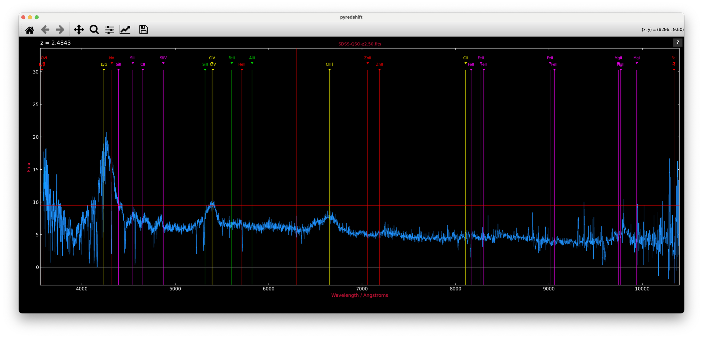

# pyredshift

Interactive redshifting of 1D astronomical spectra, by eye.

`pyredshift` plots a spectrum histogram-style with a full-window crosshair
cursor and overlays rest-frame line identifications that follow a trial
redshift. Mark a feature you recognise, and the line labels jump to that
redshift; refine, zoom, bin, smooth, fit a continuum and measure equivalent
widths — all from single keypresses. It is the Python descendant of the
author's venerable `redshift.f` (Fortran/Figaro, 1990s) via `pdlredshift`
(Perl/PDL/PGPLOT), and deliberately keeps that fast keyboard-driven feel.



*An SDSS quasar from [Example-Spectra](Example-Spectra/) at z = 2.48 and
counting, in `--retro` mode: Lyα, CIV and CIII] lined up; the crosshair
cursor mid-hunt.*

## Install

```
pip install git+https://github.com/karlglazebrook/pyredshift
```

or from a checkout:

```
pip install .
```

This installs the `pyredshift` command into the active python's `bin/`
(e.g. `anaconda3/bin`) and the `pyredshift` package into `site-packages`.
Requires python ≥ 3.9 with numpy, matplotlib, astropy and scipy.

## Usage

```
pyredshift spectrum.fits              # format auto-detected
pyredshift spectrum.fits -f sdss      # force a format
pyredshift spectrum.fits -z 2.19      # start from a known redshift
pyredshift spectrum.fits --retro      # retro PGPLOT-style black background
```

The file format is auto-detected by inspecting the FITS structure and
column names/units:

| Format     | Description                                                       |
|------------|-------------------------------------------------------------------|
| `fits`     | 1D (or 2D — row 1) FITS image with WCS; `CD1_1` overrides `CDELT1`, IRAF/SDSS log-λ flags handled |
| `sdss`     | SDSS binary table (`LOGLAM`/`FLUX`, either case)                  |
| `table`    | generic binary table with wave+flux columns; `TUNIT` (µm, nm, Å) converted automatically (aliases: `jwst`, `gabe`, `dja`) |
| `xs`       | XSHOOTER 1D table spectrum (nm)                                   |
| `xs2`      | XSHOOTER as a FITS image in extension 1                           |
| `outthere` | OutThere multi-extension grism spectra, stitched and flat-calibrated |
| `csv`      | comma-separated, header rows skipped                              |
| `ascii`    | 2-column text                                                     |

Wavelengths that look like microns are converted to Ångstroms; NaNs are
treated as bad pixels and plot as gaps, with orange markers along the
bottom of the frame.

Real spectra to practice on are included in
[Example-Spectra](Example-Spectra/) — the true redshifts are hidden in
their FITS headers.

### From a Jupyter notebook

The interactive module also works straight from a notebook, given numpy
arrays:

```python
from pyredshift import redshift as redshift_module
z = redshift_module.redshift(wave, flux)
```

The interactive window opens *outside* the notebook (inline backends
cannot deliver events to it) and the cell blocks until you quit with
`q`; the final annotated view is then embedded in the cell output and
the redshift returned. Any non-interactive backend (e.g. `%matplotlib
inline`) is switched to a GUI backend for the session and restored
afterwards.

## Interaction

Press `?` (or click the `?` button) for the full command reference — it
opens as a themed page in your browser, with the complete line list and a
short guide in separate tabs. The essentials:

- **Identify a line**: put the crosshair on a feature and press `ESC`
  followed by a shortcut key (`a` = Hα, `b` = Hβ, `l` = Lyα, `o` = [OII],
  `c` = CIV ...), or `g` to type any rest wavelength. Press `ESC ESC` on a
  sharp line to refine the redshift; `=` enters a redshift directly.
- **Navigate**: drag the mouse for a rubber-band zoom (a purely horizontal
  drag zooms X only), `z`/`u` and `i`/`o` zoom about the cursor, `[` `]`
  pan, `w` whole range, `a` autoscale, `h` home. The matplotlib toolbar
  works too and stays in sync.
- **Analyse**: `b` bin, `s` smooth, `_` iterative continuum fit,
  `m` equivalent width and line flux, `B` zap artefacts, `p` print to PDF.
- **Quit**: `q` — the final redshift is reported on the terminal.

Line identifications come from `pyredshift.lines` (CSV: wavelength, name,
label, matplotlib colour, comment — all vacuum wavelengths), installed
alongside the module and easy to customise. The window size and aspect
ratio are remembered between runs in `~/.pyredshift.json`. A template
spectrum can be overlaid with `t` (searched for in `$DATADIR`,
`$NEWMODELS/Spectra`, then `~/Templates/Spectra`).

## Layout

```
pyredshift            the command-line script: format detection and reading
src/pyredshift/       the interactive module (redshift.py) + data files
```

The script prefers a `src/pyredshift/` found next to it or under the
current directory, so a development checkout always runs its own code.

## Credits

Karl Glazebrook, Swinburne University of Technology.

Lineage: `redshift.f` (FIGARO/Fortran, ~1992) → `pdlredshift` (Perl/PDL) →
`pyredshift`. Ported with the assistance of Claude (Anthropic).

MIT license — see [LICENSE](LICENSE).
